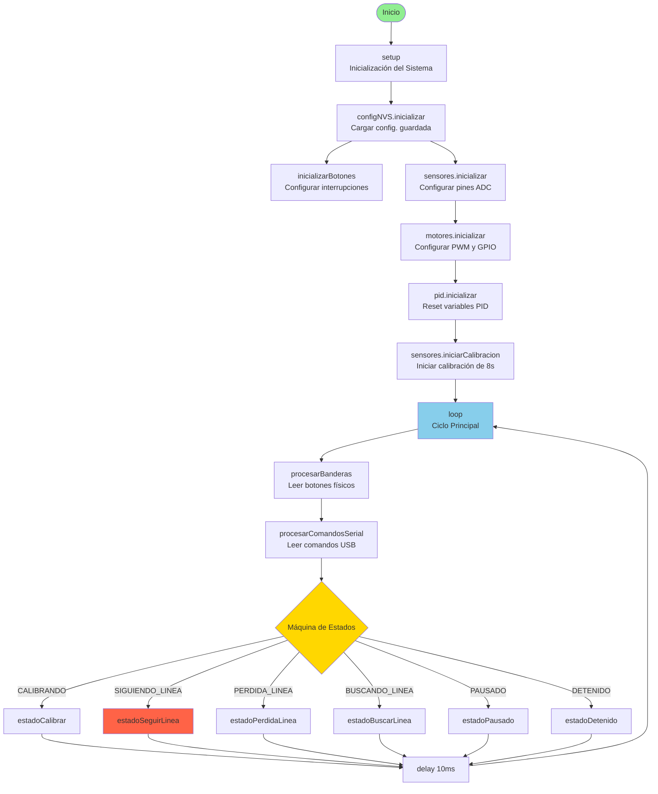
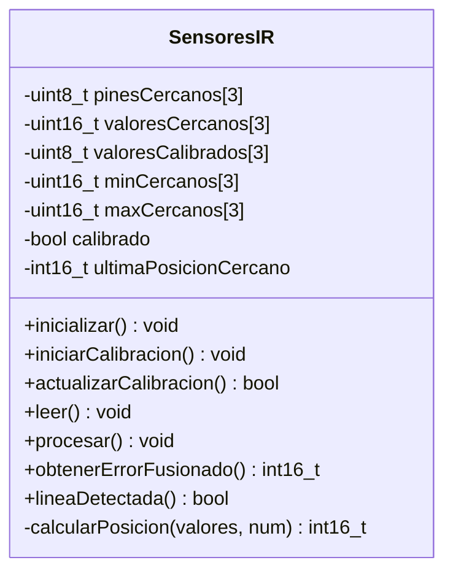
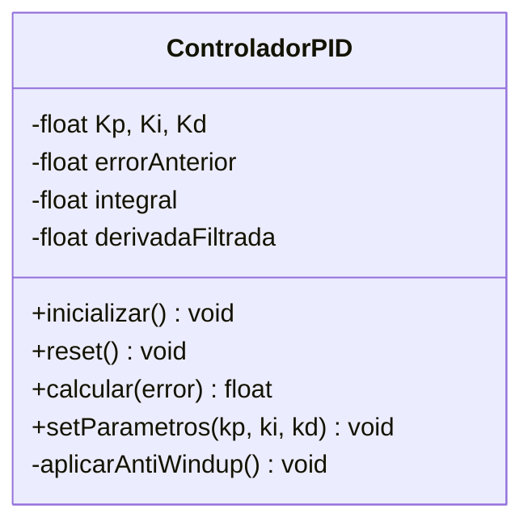
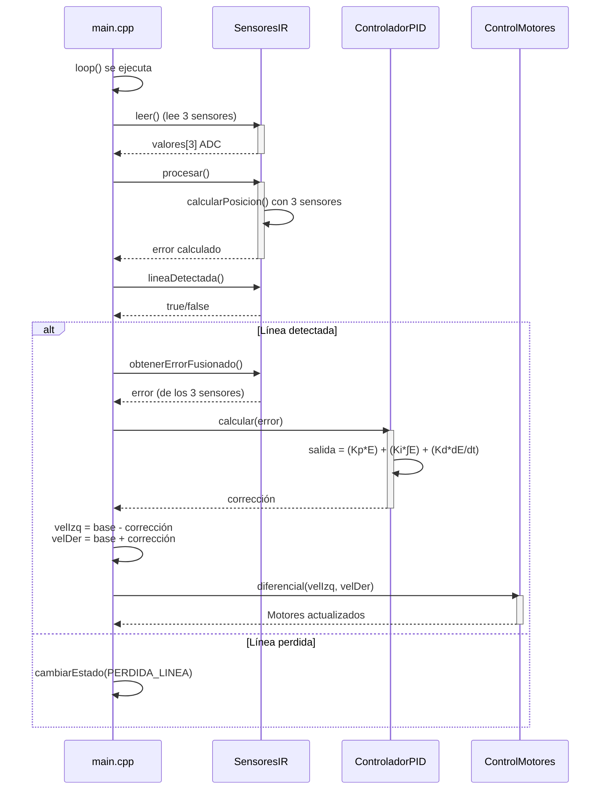

# Diagrama de Funciones - Carrito Seguidor de Línea ESP32-S3 (Config. Simplificada)

## Diagrama de Flujo Principal



## Diagrama de Estado: SIGUIENDO_LINEA (Lógica Actual)

Este diagrama refleja la lógica simplificada con 3 sensores. No hay "fusión de sensores" ni "PID adaptativo" basado en curvatura.

```mermaid
flowchart TD
    Start([estadoSeguirLinea]) --> ReadSensors[sensores.leer<br/>Leer 3 sensores ADC]
    ReadSensors --> Process[sensores.procesar<br/>Calibrar valores 0-100<br/>Calcular posición ponderada]

    Process --> CheckLine{sensores.lineaDetectada<br/>¿Línea visible?}
    CheckLine -->|NO| Lost[tiempoPerdidaLinea = millis<br/>cambiarEstado(PERDIDA_LINEA)]
    CheckLine -->|SÍ| GetError[error = sensores.obtenerErrorFusionado<br/><b>(Devuelve error de los 3 sensores)</b>]

    GetError --> CalcPID[correccion = pid.calcular(error)<br/>P = Kp × error<br/>I = Ki × Σerror<br/>D = Kd × Δerror/Δt]

    CalcPID --> CalcVel[velIzq = velocidadBase - correccion<br/>velDer = velocidadBase + correccion]
    CalcVel --> ApplyMotors[motores.diferencial<br/>setMotorIzquierdo<br/>setMotorDerecho]
    ApplyMotors --> End([Return])

    Lost --> End

    style Start fill:#90EE90
    style CheckLine fill:#FFD700
    style GetError fill:#87CEEB
    style End fill:#90EE90
```

## Diagrama de Clases (Simplificado)

### `SensoresIR`
Gestiona los 3 sensores.


### `ControladorPID`
Implementa el algoritmo PID con un único set de parámetros.


## Diagrama de Secuencia: Ciclo de Seguimiento Simplificado



---
**Última actualización:** 2025-11-05